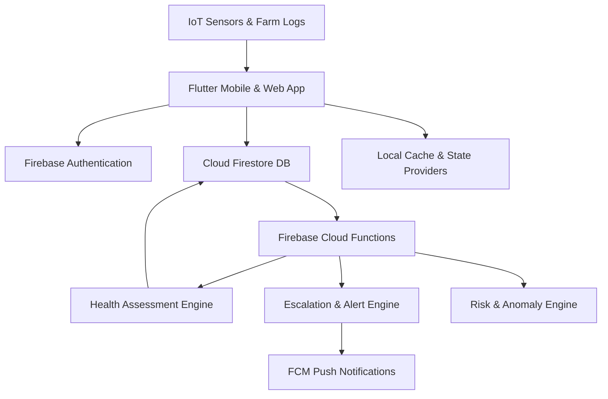

# FlockSense - Smart Poultry Management & Prediction Platform 🐔📊

[](https://flutter.dev)
[](https://firebase.google.com)
[](https://www.typescriptlang.org/)
[](LICENSE)

**FlockSense** is an enterprise-grade, AI-powered poultry farm management and real-time biometric prediction system. Designed for broiler and layer operations, it delivers automated health risk assessments, growth velocity forecasting, mortality early-warning signals, FCR analytics, and financial optimization.

---

## 🌟 Key Capabilities & Modules

### 🤖 1. AI Biometric & Health Prediction Engine
- **Early Warning Risk Matrix**: Continuous evaluation of flock health, mortality spikes, water intake shifts, and environmental stress (Temperature-Humidity Index / THI).
- **Automated Vet Escalation**: Triggered protocols for veterinary intervention based on anomaly confidence scores.
- **Disease & Biosecurity Index**: Real-time biosecurity compliance scoring and disease vector tracking.

### 📈 2. Advanced Performance & Growth Analytics
- **Feed Conversion Ratio (FCR)**: Live calculation and benchmark comparisons against breed standard growth curves (Cobb 500, Ross 308).
- **Average Daily Gain (ADG) & Body Mass**: Daily weight sample distributions, uniformity curves, and projected harvest weights.
- **European Production Efficiency Factor (EPEF)**: Real-time efficiency rating and historical batch comparison.

### 🏢 3. Multi-Farm & Shed Infrastructure
- Hierarchical multi-location farm management with shed-level sensor integration.
- Batch lifecycle tracking from Day 0 placement to depletion/harvest.
- Density and stocking capacity optimization calculators.

### 📋 4. Daily Entry & Activity Auditing
- Quick logging for daily mortality, feed consumption, water intake, temperature, and humidity.
- Medication, vaccine administration logs with batch withdrawal period tracking.

### 📦 5. Inventory & Supply Chain
- Feed silo levels, medical supplies, and equipment stock monitoring with low-stock alerts.
- Automatic depletion tracking synced with daily logging entries.

### 💰 6. Financial Ledger & Bird Sales
- Batch-level P&L statements, operational expenses (feed, energy, labor, health).
- Bird sales dispatch records, live weight totals, and revenue realization.

### 📑 7. Enterprise Reporting & Exports
- Multi-format report generation: **PDF Summaries**, **Excel Worksheets (.xlsx)**, and **CSV Data Streams**.
- Filter by date range, farm, shed, breed, and batch identifier.

---

## 🏛 System Architecture



---

## 🚀 Getting Started

### Prerequisites
- **Flutter SDK**: `>= 3.0.0`
- **Dart SDK**: `>= 3.0.0`
- **Node.js**: `>= 18.x` (for Cloud Functions)
- **Firebase CLI**: `npm install -g firebase-tools`

### Installation

1. **Clone the repository**:
   ```bash
   git clone https://github.com/Muthudeenathayalan/FlocksensePrediction.git
   cd FlocksensePrediction
   ```

2. **Install Flutter Dependencies**:
   ```bash
   flutter pub get
   ```

3. **Install Functions Dependencies**:
   ```bash
   cd functions
   npm install
   npm run build
   cd ..
   ```

4. **Run the Application**:
   ```bash
   flutter run
   ```

---

## 📂 Project Structure

```
lib/
├── app/                  # Application routing, themes, and global constants
├── config/               # App configuration & environment presets
├── core/                 # Shared core utilities, base services, error handling
├── features/             # Feature-first modular domain architecture
│   ├── ai/               # AI prediction models & insight widgets
│   ├── auth/             # Authentication & user identity
│   ├── batches/          # Flock batch management
│   ├── calendar/         # Farm event calendar & task planner
│   ├── daily_entry/      # Daily farm activity logging
│   ├── daily_records/    # History and record review
│   ├── dashboard/        # Executive telemetry dashboard
│   ├── farms/            # Multi-farm directory
│   ├── feed/             # Feed management & silo tracking
│   ├── finance/          # Cash flow, P&L, expense tracking
│   ├── flock/            # Bird flock profile management
│   ├── health/           # Health diagnosis, risk scoring
│   ├── home/             # Main navigation & landing views
│   ├── inventory/        # Warehouse stock management
│   ├── medicine/         # Veterinary medicine records
│   ├── notifications/    # Alert center & FCM push dispatch
│   ├── onboarding/       # Farm setup wizard & walkthrough
│   ├── performance/      # FCR, ADG, EPEF calculation engines
│   ├── profile/          # User preferences & account settings
│   ├── reports/          # PDF/Excel/CSV generator services
│   ├── sales/            # Commercial sales and harvest dispatch
│   ├── settings/         # Farm parameters & app configuration
│   ├── sheds/            # Housing & shed monitoring
│   ├── support/          # Help center & documentation
│   ├── vaccination/      # Vaccine schedules & compliance
│   ├── vaccine/          # Vaccine repository
│   └── weight/           # Weight growth tracking & sampling
├── functions/            # Firebase Cloud Functions (TypeScript)
│   └── src/health/       # Risk engines, AI assessment & escalation
├── scripts/              # Data seeding & simulation scripts
└── shared/               # Reusable UI widgets, animated charts & styles
```

---

## 🤝 Contributing

Contributions are welcome! Please read [CONTRIBUTING.md](CONTRIBUTING.md) for details on our code of conduct and development workflow.

---

## 📄 License

This project is licensed under the MIT License - see the [LICENSE](LICENSE) file for details.
