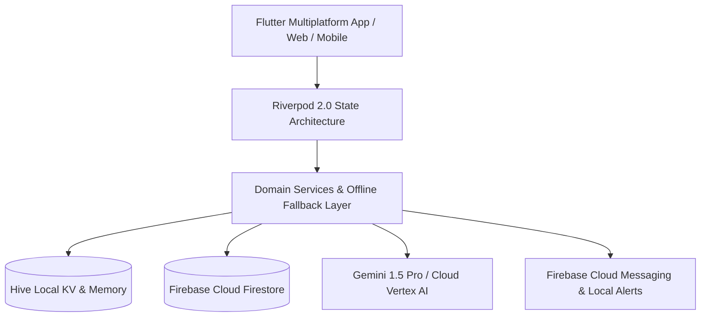

# FlockSense Architecture & Engineering Blueprint

## 1. Overview
**FlockSense** is an enterprise-grade poultry farm telemetry, predictive risk intelligence, and veterinary clinical surveillance system built with Flutter, Riverpod, and Google Cloud Firebase.

---

## 2. Core Architectural Principles

### 2.1 Reactive Stream Repository Pattern
All domain features expose reactive broadcast streams (`watchFarms`, `watchBatches`, `watchDailyRecords`) that guarantee:
- **Synchronous First-Frame Delivery**: Never blocks on network roundtrips.
- **Offline & Prototype Resilience**: Operates in zero-latency offline mode with in-memory persistence.
- **Real-Time Synchronization**: Automatically merges Firestore snapshots when authenticated.

### 2.2 Domain Separation
The codebase is structured under feature-first modularity:
- `features/farms`: Farm facility registry, biosecurity status, and geographic boundary tagging.
- `features/batches`: Flock placement, live bird decrement tracking, and harvest projection.
- `features/daily_records`: High-speed multi-metric daily operational logging (feed, water, mortality, diesel generators).
- `features/health`: Disease outbreak alerting, AI differential diagnosis, and veterinary clinical workflows.
- `features/performance`: FCR (Feed Conversion Ratio), EPEF (European Production Efficiency Factor), and ADG analytics.
- `features/inventory`: Dynamic stock ledger, automatic daily consumption deductions, and reorder alerts.
- `features/reports`: Multi-format PDF, Excel, and CSV enterprise data export engine.

---

## 3. Telemetry Formulas & Analytics Engine

### 3.1 Feed Conversion Ratio (FCR)
$$\text{Day FCR} = \frac{\text{Total Feed Consumed (kg)}}{\text{Live Bird Count} \times \text{Average Daily Gain (kg)}}$$

### 3.2 European Production Efficiency Factor (EPEF)
$$\text{EPEF} = \frac{\text{Survival Rate (\%)} \times \text{Live Weight (kg)}}{\text{Age in Days} \times \text{Cumulative FCR}} \times 100$$

### 3.3 Temperature-Humidity Index (THI)
$$\text{THI} = 0.8 \times T + \left(\frac{H}{100}\right) \times (T - 14.4) + 46.4$$
*Where $T$ is temperature in °C and $H$ is relative humidity percentage.*
